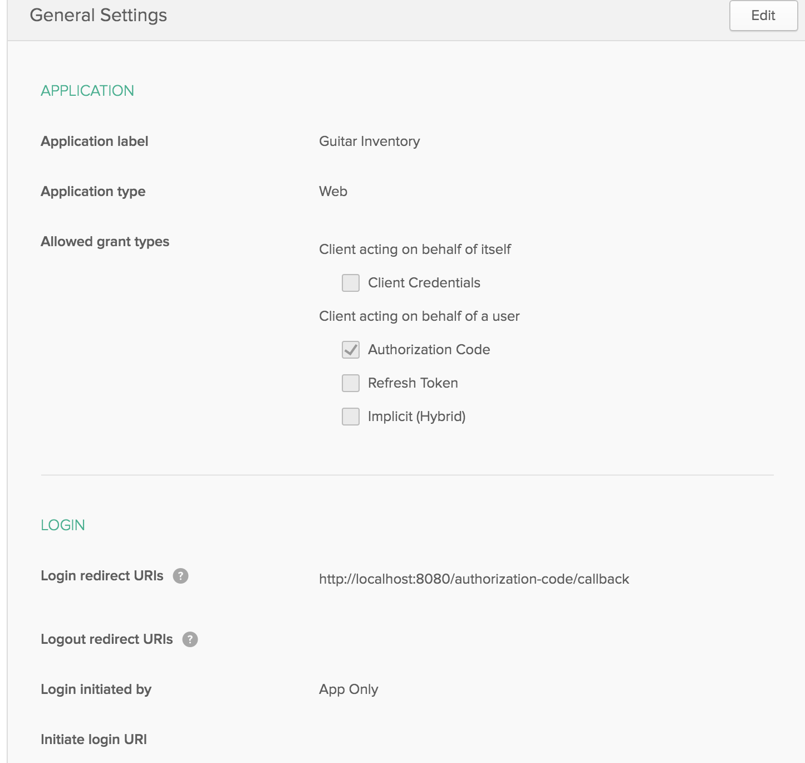
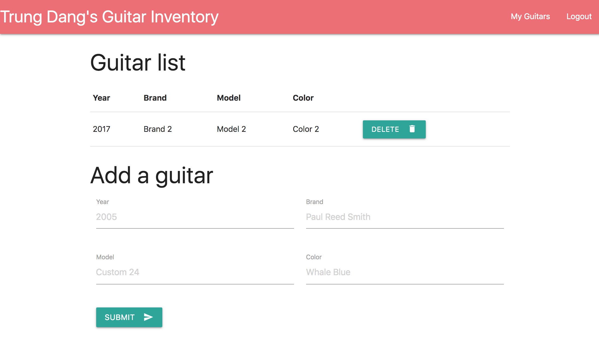

### Use TypeScript to Build a Node API with Express

- Tutorial referenct at post: https://developer.okta.com/blog/2018/11/15/node-express-typescript
- Sign up for a free Okta Developer account
- You will get a URL similar to https://dev-123456.oktapreview.com.
  - Save this URL for later
  - You will also use this URL to login to your Okta account
- Create docker container postgres (ref blog post)

You will need to create an application in Okta:

- Log in to your Okta account, then navigate to **Applications** and click the **Add Application** button
- Select **Web** and click **Next**
- Give your application a name (e.g. "Simple Node Authentication")
- Change the **Base URI** to `http://localhost:3000` and the **Login redirect URI** to `http://localhost:3000/authorization-code/callback`, then click **Done**
- Save your **client ID** and **client secret** for later

Your Okta application should have settings similar to the following:


Now create a file called .env in the project root and add the following variables, replacing the values with your own from the previous steps.

```bash
# Set to production when deploying to production
NODE_ENV=development

# Node.js server configuration
SERVER_PORT=8080
HOST_URL=http://localhost:8080
SESSION_SECRET=[YOUR SECRET SESSION]

# Okta configuration
OKTA_ORG_URL=https://dev-228303.okta.com
OKTA_CLIENT_ID=[YOUR CLIENT ID]
OKTA_CLIENT_SECRET=[YOUR CLIENT SECRET]

# Postgres configuration
PGHOST=localhost
PGUSER=postgres
PGDATABASE=postgres
PGPASSWORD=p@ssw0rd42
PGPORT=5432

```

Now run the application:

```bash
npm install
npm run dev
```


